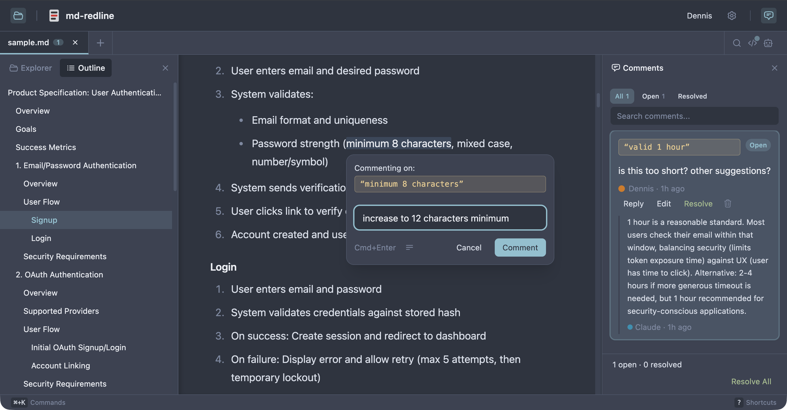

#  md-redline

Review rendered markdown with inline comments that live in the file.

`mdr` is a local review tool for markdown files in human + AI agent workflows. Highlight text in the rendered document, leave feedback, then hand the same file to an agent. Comments are stored inline in the `.md` file itself, so agents can read and address them directly. No sidecar files, no database, no external service. The markdown file stays the source of truth.

Markdown has become a common working format for specs, prompts, and design docs between humans and agents. `mdr` gives that workflow review tooling closer to code review: rendered context, inline comments, and a clean diff after changes are made. As Sean Grove argues in [specs are the new code](https://www.youtube.com/watch?v=8rABwKRsec4), specs are becoming the primary unit of work in agentic development. You write and review the spec, agents write the code.



**See the full review workflow in 30 seconds:**

https://github.com/user-attachments/assets/855a9d02-b0fd-4dec-b0a5-742871e8c181

## Review workflow

### Default: comments as agent instructions

1. Open a markdown file in `mdr`.
2. Highlight text and leave inline comments.
3. Copy the hand-off prompt.
4. Paste the prompt into your AI agent.
5. The agent edits the file, addresses the feedback, and removes the comment markers it handled.
6. Review the result in diff view.

### Optional: resolve workflow

Enable resolve mode in Settings for human review with explicit `open` and `resolved` states.

## Quick start

Prerequisite: Node 20 or newer.

```bash
npx md-redline /path/to/spec.md
```

This starts the local app if needed and opens it in your browser.

Or install globally:

```bash
npm install -g md-redline
mdr /path/to/spec.md        # Open a file
mdr /path/to/dir             # Open a directory
mdr --stop                   # Stop the running server
```

`md-redline` also works as an alias for `mdr`.

## How comments are stored

Comments are stored as invisible HTML markers directly in the markdown, immediately before the text they refer to, so both humans and agents can work from the same file.

```markdown
Some text <!-- @comment{
  "id":"uuid",
  "anchor":"highlighted text",
  "text":"Rewrite this section to be clearer.",
  "author":"User",
  "timestamp":"2026-03-26T12:00:00.000Z",
  "replies":[]
} -->highlighted text continues here.
```

This makes feedback:

- visible to AI agents via a plain file read
- portable with the markdown file
- invisible in normal renderers (GitHub, VS Code preview)

## Who this is for

- **People writing specs, prompts, or design docs locally** with file-based AI agents
- **Teams reviewing docs before they are committed** or sent out for wider review
- **Anyone in a human + agent editing loop** who wants structured inline feedback in plain files

### Non-goals

- Not a collaborative multi-user editing tool.
- Not a replacement for GitHub PR reviews (use those once the file is in git).
- Not designed for untrusted content. This is a local dev tool for your own files.

## Features

### Review and commenting

- Inline comments anchored to rendered text, including overlapping comments
- Threaded replies and optional `open` / `resolved` review states
- Adjustable anchors with drag handles
- Rendered, raw, and diff views
- Hand-off prompt copying for one or multiple files

### Navigation and editing

- Multi-tab editing with session persistence and tab context menus
- File explorer, recent files, and native OS file picker
- Find in document (`Cmd+F`) with match navigation
- Table of contents with scroll spy
- Command palette (`Cmd+K`), keyboard shortcuts, and settings panel (`Cmd+,`)
- Resizable panels and right-click context menus

### Rendering and integrations

- Real-time reload via SSE when files change externally
- Mermaid diagram rendering with commentable text
- Customizable comment templates
- 8 themes: Light, Dark, Sepia, Nord, Solarized, GitHub, Rosé Pine, Catppuccin

## Supported platforms

- **macOS**: supported
- **Linux**: supported; system file picker requires `zenity`
- **Windows**: supported; system file picker uses PowerShell

## Security model

`mdr` is a local dev tool. The server reads and writes markdown files inside the current working directory and any path explicitly opened at startup or through the system file picker. File saves use atomic write-then-rename and mtime-based conflict detection to prevent data loss from concurrent edits.

Only run it in environments you trust. Mermaid SVG output is sanitized via DOMPurify before rendering.

## Development

### From source

```bash
git clone https://github.com/dejuknow/md-redline.git
cd md-redline
npm install
npm run dev
```

Open the local URL printed by Vite (usually `http://localhost:5188`).

### Scripts

```bash
npm run dev          # Start dev server
npm run lint         # Lint
npm test             # Production build + unit tests
npm run test:e2e     # Playwright E2E tests
npm run build        # Production build
```

### Agent eval

The eval harness tests whether AI agents correctly read, address, and remove inline comments.

- `npm run eval:dry` validates eval fixtures
- `npm run eval` runs the full eval harness
- See [eval/README.md](./eval/README.md) for details

## Architecture

```text
bin/md-redline             CLI entry point (invoked as `mdr` or `md-redline`)
server/index.ts            Hono server for file I/O, browsing, SSE, and local integrations
src/App.tsx                Main application shell
src/components/            Viewer, sidebar, raw view, diff view, TOC, explorer, settings, etc.
src/hooks/                 State, persistence, selection, file watching, drag handles, tabs
src/lib/comment-parser.ts  Inline comment parsing and mutation helpers
src/markdown/pipeline.ts   Markdown rendering pipeline
eval/                      Eval harness for agent behavior against inline comments
e2e/                       Playwright end-to-end coverage
```

## License

[MIT](./LICENSE)
