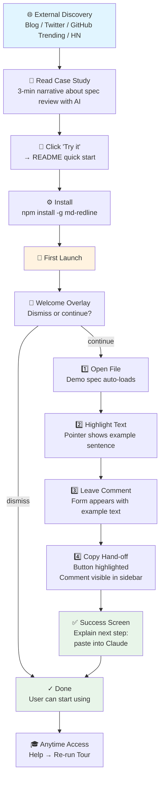

# Product Spec: PM Onboarding for md-redline

**Date:** 2026-04-04  
**Status:** Design phase  
**Owner:** Product team  
**Target:** Product managers discovering and using md-redline for spec review

---

## Problem

Product managers don't know md-redline exists. The tool solves a real workflow problem (review specs with inline AI feedback), but without discovery mechanisms, adoption is blocked at awareness. Once PMs find the tool, they need confidence that they can use it immediately—minimal friction on first launch.

---

## Solution

A two-part onboarding strategy:

1. **External discovery phase** (blog, SEO, social, docs)—educate on why PMs need this
2. **In-app guided tour** (first-launch overlay)—teach how to complete one full workflow in ~90 seconds

The external component is load-bearing; the in-app experience is lightweight because we assume users arrive partially convinced. The tour just de-risks their first try.

---

## Target Users

**Primary:** Product managers who review specs and design docs, work with AI agents (Claude, etc.), and want a lightweight review tool with inline feedback.

**Secondary:** Anyone in spec/prompt/design-doc review loops with agents.

---

## Success Definition

**When a PM completes onboarding, they should be able to:**
- Open a markdown file in md-redline
- Highlight text in the rendered document
- Leave an inline comment
- Copy the hand-off prompt
- Paste it to Claude for agent review

---

## Onboarding Flow

### Phase 1: External Discovery

**Entry points:**
- Blog post: "How I review specs with Claude" (case study, narrative-driven)
- Twitter: Product-focused threads about spec review + AI workflow
- GitHub Trending / Product Hunt: When we ship or highlight the feature
- HN: Launch post, feature announcement
- SEO: "markdown spec review tool", "AI-powered spec comments"

**Actions:**
1. PM discovers md-redline through one of above
2. Reads a 3-minute case study explaining the value (pain point → solution)
3. Clicks "Try it" → directed to README quick-start section
4. Installs via `npm install -g md-redline` or `npx md-redline`

### Phase 2: In-App Guided Tour (First Launch)

When the app starts for the first time, show an optional overlay tour:

**Step 1: Welcome**
- Overlay: "Welcome to md-redline. Let's review a spec in 90 seconds."
- Buttons: "Start tour" or "Skip"
- If skip: dismiss and show normal app; user can restart tour from Help menu anytime

**Step 2: Open File**
- Overlay prompt: "Open a markdown file to get started."
- Demo action: A demo spec file auto-loads with placeholder content (sample spec section with 2–3 paragraphs)
- Pointer: Arrow points to the rendered spec content
- User action: User can click "Open file" button or select a file from file picker

**Step 3: Highlight Text**
- Overlay prompt: "Highlight a sentence you'd like to comment on"
- Pointer: Highlights a specific sentence in the demo spec
- User action: User selects text (can be the suggested sentence or any text)

**Step 4: Leave Comment**
- Overlay prompt: "Add your first comment"
- Auto-show: Comment form appears below/beside the highlighted text with placeholder example
- User action: User types comment text and submits (or clicks the pre-filled example to send)
- Sidebar: Comment appears in the comments sidebar in real-time

**Step 5: Copy Hand-off Prompt**
- Overlay prompt: "Copy your review to share with an AI agent"
- Highlight: "Copy hand-off prompt" button in the UI is highlighted
- User action: User clicks button (prompt copied to clipboard)

**Step 6: Success Screen**
- Overlay: "You just created your first review. Paste this into Claude and your agent will address it."
- Call-to-action: "Done" button
- Optional: Checkbox "Don't show this again"

**Step 7: Persistent Access**
- Once dismissed, a subtle "Help → Tutorial" link in settings menu allows re-running the tour

---

## Flow Diagram

---

## Implementation Details

### In-App Tour Technical Requirements

- **First-launch detection:** Track `isFirstLaunch` in app state (check localStorage or settings file)
- **Demo spec file:** Create a lightweight `.md` file bundled with the app or served from in-memory. Include sample spec content (e.g., feature request, design doc excerpt)
- **Overlay UI:** Semi-transparent modal with step indicator (1/6, 2/6, etc.), action buttons, and optional pointer/highlight to guide attention
- **Keyboard navigation:** Escape to skip/dismiss; Enter/Cmd+Enter to proceed to next step
- **Accessibility:** ARIA labels, focus management, keyboard-friendly interaction
- **Skip option:** "Skip tour" button on every step; don't force completion
- **Persistence:** Store tour state (completed/dismissed) so it doesn't repeat; allow re-access via Help

### External Content Requirements

- **Blog post:** 800–1200 words, narrative-driven case study. Include: problem statement, why existing tools don't work, how md-redline solves it, quick demo, link to install
- **Social strategy:** 2–3 tweet threads (Twitter/X), LinkedIn post, maybe a short video clip (~30 sec)
- **Documentation updates:** 
  - Add "Getting Started" section to README highlighting the core 90-second workflow
  - Link prominently to blog post from README
  - Create `ONBOARDING.md` with extended step-by-step guide for users who skip the tour

---

## Success Metrics

### Primary Metric: Adoption Rate
- **Definition:** % of users who install md-redline and complete the onboarding tour
- **Target:** 60%+ completion rate
- **Why:** High completion = users felt discovery + value prop working; confidence to try built
- **Measurement:** Track first-launch analytics (welcome overlay shown → tour completed)

### Secondary Metrics

**First-use success:** % of users who complete a full workflow (open → highlight → comment → copy) within 7 days of installation
- Target: 70%+
- Why: Validates that tour → actual usage; not just feature-completeness

**Retention at 30 days:** % of users who launched the tool at least once in the second/third/fourth week after installation
- Target: 40%+
- Why: Early indicator of lasting value; shows if one-time use → habit

**Satisfaction (optional):** NPS or "Would you recommend?" prompt after tour completion
- Target: 50+
- Why: Qualitative signal of value perception

### Discovery Metrics (Monitor Traffic Pipeline)

**Blog traffic:** # visits to case study / tutorial articles
- Track page views, time on page, click-through to install
- Why: Indicates if discovery content resonates; feeds into install funnel

**Referral source:** % of installs from blog/Twitter vs. organic search vs. direct
- Why: Shows which discovery channels drive adoption

**Time-to-install:** Median time from discovery → first install
- Target: <5 minutes (blog to npm install)
- Why: Low friction = healthy funnel

---

## Scope & Constraints

**In scope:**
- First-launch tour overlay (6 steps)
- Demo spec file bundled with app
- Blog post (case study format)
- Social content (2–3 posts)
- Help menu → "Tutorial" link to re-run tour
- Updated README with Getting Started section

**Out of scope:**
- Video tutorials (future iteration)
- Interactive documentation site (future)
- Advanced feature tours (resolve mode, settings, keyboard shortcuts)
- Email/push notification campaigns
- Paid acquisition or ads

---

## Non-Goals

- This onboarding does not teach the full feature set (multi-tab editing, keyboard shortcuts, resolve mode, etc.). Those are "learn as you go" via Help menu and documentation.
- This is not a comprehensive spec review course; it assumes PMs understand why they need a review tool.
- Not targeting other user personas (developers, content teams) yet; initial focus is PMs.

---

## Open Questions / Future Iterations

1. **Internationalization:** Should the tour and blog post be translated? (Scope for v2)
2. **Video demo:** Add 30-sec demo video on README and in tour? (Validate demand first)
3. **Email follow-up:** Send PM-focused tips email 24h after first use? (Measure drop-off first)
4. **Advanced tours:** Separate tutorials for resolve mode, keyboard shortcuts, themes? (Once core adoption stabilizes)

---

## Success Criteria (How We Know It Worked)

- ✅ 60%+ of new users complete the onboarding tour
- ✅ 70%+ of tour completers do a full workflow (open → highlight → comment → copy) within 7 days
- ✅ 40%+ of users return to the tool within 30 days (retention baseline)
- ✅ Blog post drives >500 visits in first month
- ✅ No critical blockers reported in first-use feedback (Help → Feedback form)
