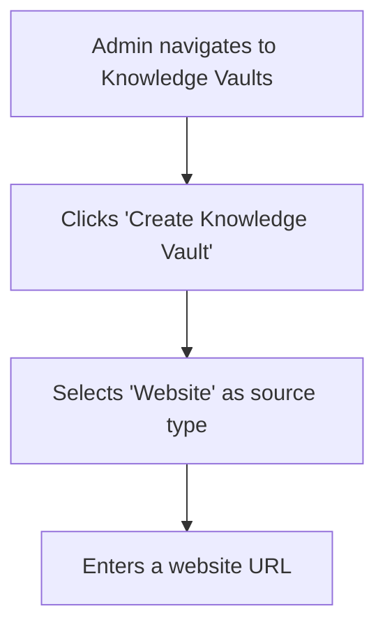
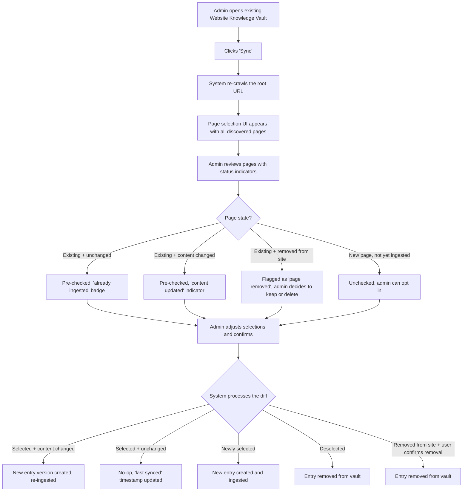
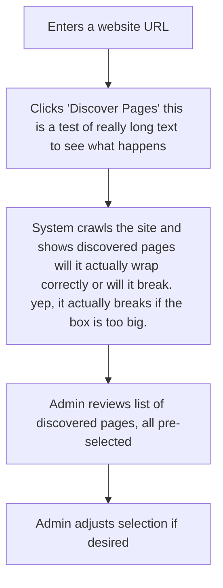

# Mermaid Highlight Regression

## Flow

```mermaid
flowchart TD
    A[Admin navigates to Knowledge Vaults] --> B[Clicks 'Create Knowledge Vault']
    B --> C[Selects 'Website' as source type]
    C --> D[Enters a website URL]
```

## Sync Flow

```mermaid
flowchart TD
    A[Admin opens existing Website Knowledge Vault] --> B[Clicks 'Sync']
    B --> C[System re-crawls the root URL]
    C --> D[Page selection UI appears with all discovered pages]
    D --> E[Admin reviews pages with status indicators]
    E --> F{Page state?}
    F -->|Existing + unchanged| G[Pre-checked, 'already ingested' badge]
    F -->|Existing + content changed| H[Pre-checked, 'content updated' indicator]
    F -->|Existing + removed from site| I[Flagged as 'page removed', admin decides to keep or delete]
    F -->|New page, not yet ingested| J[Unchecked, admin can opt in]
    G --> K[Admin adjusts selections and confirms]
    H --> K
    I --> K
    J --> K
    K --> L{System processes the diff}
    L -->|Selected + content changed| M[New entry version created, re-ingested]
    L -->|Selected + unchanged| N[No-op, 'last synced' timestamp updated]
    L -->|Newly selected| O[New entry created and ingested]
    L -->|Deselected| P[Entry removed from vault]
    L -->|Removed from site + user confirms removal| Q[Entry removed from vault]
```

## Long Labels

```mermaid
flowchart TD
    A[Enters a website URL]
    A --> B[Clicks 'Discover Pages' this is a test of really long text to see what happens]
    B --> C[System crawls the site and shows discovered pages will it actually wrap correctly or will it break. yep, it actually breaks if the box is too big.]
    C --> D[Admin reviews list of discovered pages, all pre-selected]
    D --> E[Admin adjusts selection if desired]
```
