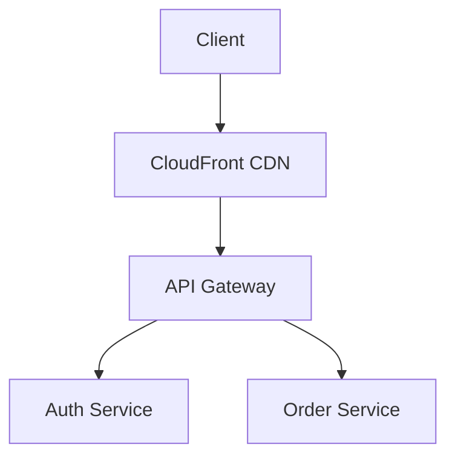

# Order Platform Architecture

## Edge components

The platform's edge layer terminates HTTPS, applies the WAF, and forwards traffic to the regional API gateway.

<!-- @comment{"id":"eval-14-c1","anchor":"API Gateway","text":"Rename this label to 'Edge Gateway' — it's misleading to call it 'API Gateway' here because it sits at the network boundary, not in front of the internal services. Update both the label inside the brackets AND any references in connection lines.","author":"PM","timestamp":"2026-04-26T10:00:00Z"} -->

The API gateway is the single ingress point — anything internal that needs to be reachable from the public internet must route through it.
