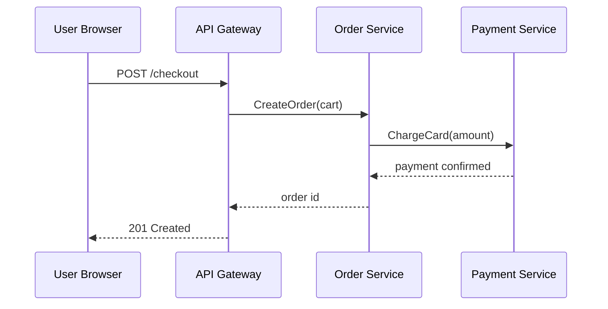

# Checkout Sequence

The checkout flow is a synchronous client-server interaction with one async fan-out at the end.

<!-- @comment{"id":"eval-15-c1","anchor":"ChargeCard(amount)","text":"Add a missing step: before Order calls Pay, it should reserve inventory. Add a new participant 'Inv as Inventory Service' and a 'ReserveItems(items)' message from Order to Inv (with a synchronous reply) before the ChargeCard line.","author":"PM","timestamp":"2026-04-26T10:05:00Z"} -->

After payment confirms the order is committed and a confirmation event is published.
