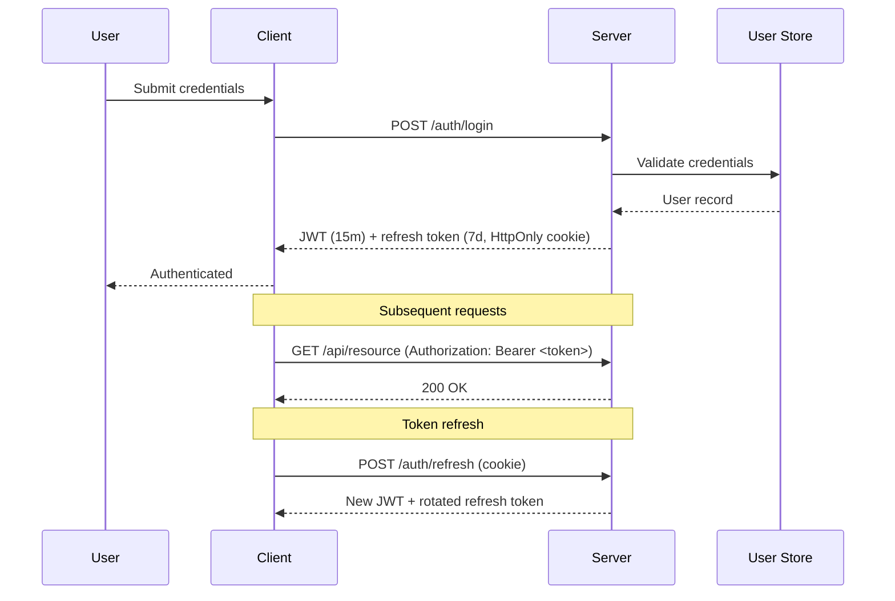

# Product Specification: User Authentication System

## Overview

This document outlines the authentication system for the application. The system supports email/password login, OAuth 2.0 with Google and GitHub providers, and magic link authentication.

## User Stories

### US-001: Email Registration

As a new user, I want to register with my email and password so that I can access the application.

**Acceptance Criteria:**

- User provides email, password, and display name
- Password must be at least 8 characters with one uppercase, one number, and one special character
- System sends verification email within 30 seconds
- User cannot access protected routes until email is verified
- User can request a new verification email after a 60-second cooldown

### US-002: OAuth Login

As a user, I want to sign in with my Google or GitHub account so that I can access the application without creating a new password.

**Acceptance Criteria:**

- "Sign in with Google" and "Sign in with GitHub" buttons are displayed on the login page
- First-time OAuth users have an account automatically created
- Returning OAuth users are matched to their existing account
- OAuth tokens are stored securely and refreshed automatically

### US-003: Magic Link Authentication

As a user, I want to sign in via a magic link sent to my email so that I can access the application without remembering a password.

**Acceptance Criteria:**

- User enters their email on the login page
- System sends a one-time login link valid for 15 minutes
- Clicking the link authenticates the user and redirects to the dashboard
- Each link can only be used once

## Technical Architecture

### Authentication Flow

1. User submits credentials (email/password, OAuth, or magic link request)
2. Server validates credentials against the user store
3. On success, server issues a JWT access token (15-minute expiry) and a refresh token (7-day expiry)
4. Access token is stored in memory; refresh token is stored in an HTTP-only cookie
5. Client includes the access token in the Authorization header for API requests

### Identity Linking Rules

- Email/password accounts and OAuth accounts map to a single `users` record
- If an OAuth provider returns a verified email that matches an existing user, the provider is linked to that existing account
- If the OAuth provider does not return a verified email, the user must complete email verification before the account becomes active
- Magic-link authentication always signs the user into the existing account for that email address; it never creates a duplicate user

### Security Considerations

- All passwords are hashed with bcrypt (cost factor 12)
<!-- @comment{"id":"demo-comment-1","text":"5 attempts per 15 minutes feels tight — legitimate users on flaky connections could get locked out. Worth considering exponential backoff instead of a hard cutoff.","author":"Alice","timestamp":"2026-03-28T10:00:00.000Z","anchor":"Rate limiting: 5 failed login attempts per IP per 15-minute window","contextBefore":"- All passwords are hashed with bcrypt (cost factor 12)\n- ","contextAfter":"\n- CSRF protection via double-submit cookie pattern"} -->
- Rate limiting: 5 failed login attempts per IP per 15-minute window
- CSRF protection via double-submit cookie pattern
- Session invalidation on password change
- Refresh tokens are rotated on every use and stored hashed at rest
- Email verification tokens and magic-link tokens are single-use and stored hashed at rest

### Database Schema

The authentication system uses the following tables:

| Table | Description |
|-------|-------------|
| `users` | Core user records with email and hashed password |
| `oauth_accounts` | Linked OAuth provider accounts |
| `sessions` | Active refresh token sessions |
| `email_verifications` | Pending email verification tokens |
| `magic_links` | Pending magic link tokens |

### API Endpoints

| Method | Path | Description |
|--------|------|-------------|
| POST | `/auth/register` | Create new account |
| GET | `/auth/verify-email/:token` | Verify email address |
| POST | `/auth/verify-email/resend` | Resend verification email |
| POST | `/auth/login` | Email/password login |
| GET | `/auth/oauth/:provider/start` | Redirect to OAuth provider |
| GET | `/auth/oauth/:provider/callback` | OAuth callback |
| POST | `/auth/magic-link` | Request magic link |
| GET | `/auth/magic-link/:token` | Consume magic link |
| POST | `/auth/refresh` | Refresh access token |
| POST | `/auth/logout` | Invalidate session |

## Open Questions

- Should we support SAML/SSO for enterprise customers in v1?
- What is the session timeout policy for inactive users?
